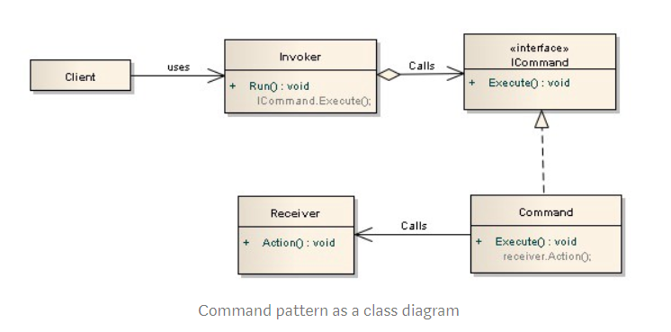

# Python Design Patterns

A collection of design patterns for python: https://python-patterns.guide/

---

## GOF Patterns

__Behavioral Patterns__:

| Pattern | Description |
|:-------:| ----------- |
| [iterator](behavioral/iterator.py) | emplements pythonic style design with 3 rules |
| [command](behavioral/command.py) | Copy Paste implementation of command design pattern |
| [command_1](behavioral/command_1.py) |  |

__Creational Patterns__:

| Pattern | Description |
|:-------:| ----------- |
| [builder_2](creational/builder_2.py) | builder description |
| [builder](creational/builder.py) | builder description |
| [prototype](creational/prototype.py) | use a factory and clones of a prototype for new instances (if instantiation is expensive) |
| [singleton_0](creational/singleton_0.py) | singleton description |
| [singleton_1](creational/singleton_1.py) | singleton description |
| [singleton_2](creational/singleton_2.py) | singleton description |
| [singleton_3](creational/singleton_3.py) | singleton description |
| [singleton_4](creational/singleton_4.py) | singleton description |

__Structural Patterns__:

| Pattern | Description |
|:-------:| ----------- |
| [composite](structural/composite.py) | lets clients treat individual objects and compositions uniformly |
| [decorator](structural/decorator.py) | wrap functionality with other functionality in order to affect outputs |
| [decorator_1](structural/decorator_1.py) | showing import time versus run time |
| [decorator_2](structural/decorator_2.py) | @functools.wraps & parameterized decorators |
| [decorator_3](structural/decorator_3.py) | making use of @singledispatch decorator to handle different input types |
| [flyweight](structural/flyweight.py) | transparently reuse existing instances of objects with similar/identical state |

---

## Videos

[Design Patterns in Python by Peter Ullrich](https://www.youtube.com/watch?v=bsyjSW46TDg)

[Sebastian Buczyński - Why you don't need design patterns in Python?](https://www.youtube.com/watch?v=G5OeYHCJuv0)

[You Don't Need That!](https://www.youtube.com/watch?v=imW-trt0i9I)

[Pluggable Libs Through Design Patterns](https://www.youtube.com/watch?v=PfgEU3W0kyU)

---
